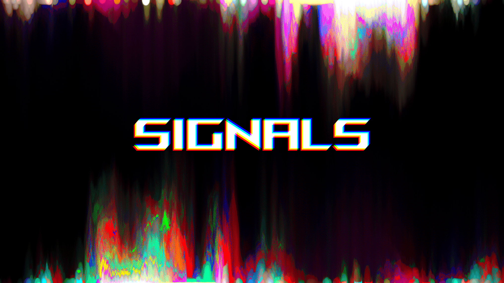

<div align="center">

[](https://archlinux.org/)
[](https://ubuntu.com/download)
[](#)
[](#)
[](#)

</div>

<p align="center">
  
</p>

---

# Overview

**Signals** is a BMP image processor built with zero dependencies for Linux/Unix systems and features a range of image editing tools, custom filters/effects, ANSI terminal rendering, and image exporting.

## Key Features
- **Effects:** Channel isolation, colour scaling, contrast, inversion, and more!
- **Transformations:** Image rotation, reversing, and flipping.
- **Steganography**: Encode secret messages for later decoding.
- **Blending:** Combine and merge images.

> Currently only supports 24-bit Windows BMP's.

## Visual Tuning Tips

- **Terminal Rendering**:
  - For the best viewing experience, zoom out in your terminal.
  - Useful for checking parameters without saving to disk.

- **Cascading Operations**:
  - You can combine flags to process multiple effects simultaneously.

---

# Examples

## Heart
```console
$ ./signals -i images/original/heartOriginal.bmp -o heart.bmp --glitch 60 --brightness-cut 245
```

<p align="center">
  
   
</p>

---

## Melt </3
```console
$ ./signals -i images/original/heartOriginal.bmp -o temp.bmp --reverse  --melt -1 --contrast 30
$ ./signals -i images/modified/heart.bmp -o dbmelt.bmp --merge temp.bmp --melt  1 --contrast 30
```

<p align="center">
  
</p>

---

## InfraBW
```console
$ ./signals -i images/original/birdsIndia.bmp -o infrabird.bmp -g -v --contrast 15 --scale-strict 1.7
```

<p align="center">
  
  
</p>

---

# Usage

### **I/O**
| Flag | Long Flag | Argument | Description |
| :--- | :--- | :--- | :--- |
| `-h` | `--help` | | Shows a helpful program usage message. |
| `-i` | `--input` | `<file>` | Input BMP file path. |
| `-o` | `--output` | `<file>` | Output file path. |
| `-m` | `--merge` | `<file>` | Overlays a second image onto the input. |
| `-c` | `--combine` | `<file>` | Averages the pixel data of two images together. |
| `-d` | `--dump` | | Dumps the BMP header data to the terminal. |
| `-p` | `--print` | | Renders the image to the terminal. |
| `-e` | `--encode` | `<file>` | Embeds contents of a file into an image. |

### **Filters**
| Flag | Long Flag | Argument | Description |
| :--- | :--- | :--- | :--- |
| `-f` | `--filter` | `<channels>` | Isolate specific channels (e.g. 'rb') |
| `-g` | `--grayscale` | | Converts to black & white (Luma). |
| `-a` | `--average` | | Convert to grayscale (Average Intensity). |
| `-v` | `--invert` | | Inverts all colors (Negative effect). |
| `-s` | `--swap` | | Swaps the red and blue color channels. |
| `-C` | `--contrast` | `<val>` | Adjusts contrast intensity (0-255). |
| `-b` | `--brightness-cut` | `<val>` | Zeros pixel colour if value exceeds cutoff (0-255). |
| `-D` | `--dim` | `<val>` | Reduce pixel intensity (0-255). |
| `-T` | `--scale-strict` | `<val>` | Colour intensity multiplier |

### **Effects**
| Flag | Long Flag | Argument | Description |
| :--- | :--- | :--- | :--- |
| `-M` | `--melt` | `<offset>` | Pixel Sorting Effect (negative input to invert). |
| `-G` | `--glitch` | `<offset>` | Apply horizontal shift effect to red and blue channels. |
| `-S` | `--scale` | `<val>` | Colour intensity multiplier (overflow allowed) |
| `-B`,| `--blur` | `<radius>`| Blurs the image using the set radius. |

### **Geometry**
| Flag | Long Flag | Argument | Description |
| :--- | :--- | :--- | :--- |
| `-r` | `--rotate` | `<N>` | Rotates image 90° clockwise `N` times. |
| `-t` | `--transpose` | | Tranposes the image. |
| `-R` | `--reverse` | | Reverse image horizontally. |
| `-F` | `--flip` | | Flips image vertically. |

## Linux Build instructions

```bash
$ git clone https://github.com/wimers/signals.git
$ cd signals
$ sudo make install
$ cd .. && rm -rf signals  # (optional cleanup after install)
```
